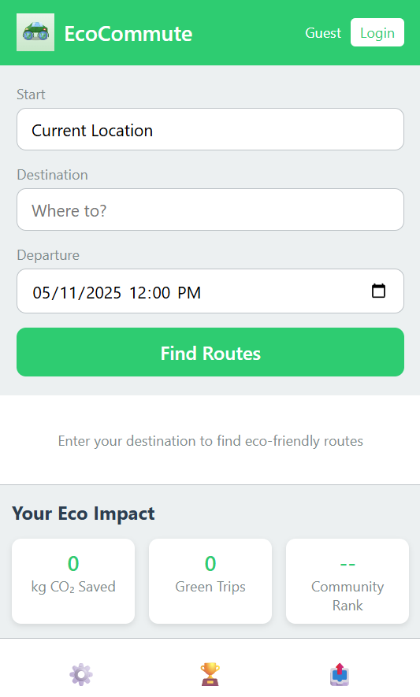

#  EcoCommute - Smart Public Transit Navigation Assistant

## Project Overview
EcoCommute is a comprehensive solution designed to make public transit more accessible, user-friendly, and environmentally sustainable. By combining real-time transit data, personalized route optimization, and gamification elements, EcoCommute encourages users to make eco-friendly transportation choices.

## Key Features
1. **Smart Route Planning**: Optimizes routes based on carbon footprint, time, and user preferences
2. **Real-time Transit Updates**: Provides live information on delays, crowding, and service changes
3. **Carbon Footprint Tracking**: Calculates and displays emissions saved compared to driving
4. **Gamification Elements**: Rewards sustainable choices with points, badges, and community challenges
5. **Personalized Recommendations**: Learns user preferences to suggest optimal transit options

## Project Components
- **Browser Extension**: User-facing interface for route planning and tracking
- **Serverless Backend**: AWS-powered infrastructure for data processing and storage
- **Transit Data Integration**: APIs for real-time transit information
- **User Profile Management**: Personalization and preference storage

## Technology Stack
- **Frontend**: JavaScript, HTML/CSS, React
- **Backend**: AWS Lambda, API Gateway, DynamoDB
- **Authentication**: Amazon Cognito
- **Data Processing**: AWS Step Functions, EventBridge
- **Analytics**: Amazon QuickSight, Kinesis

## Getting Started
See the [documentation](/docs) for setup instructions and developer guides.

## Environmental Impact
EcoCommute aims to reduce carbon emissions by making public transit more accessible and appealing, potentially saving thousands of tons of CO2 annually as adoption grows.
